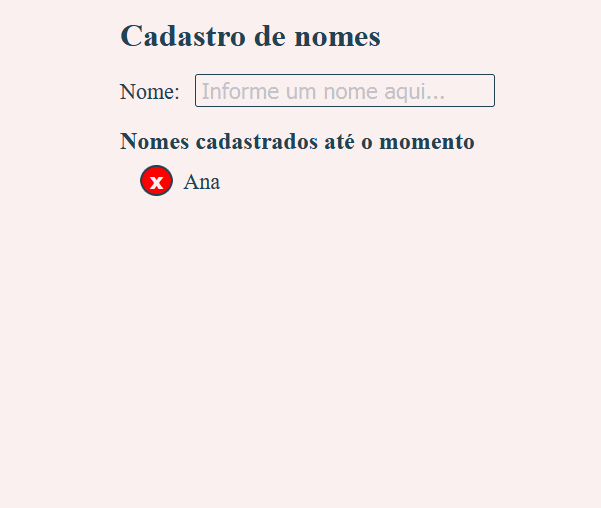

<h1 align="center">Aula 9 - CRUD com HTML, CSS e JavaScript</h1>

  

  
  
  

___

<h3 align="center">
  <a href="#information_source-sobre">Sobre</a>&nbsp;|&nbsp;
  <a href="#book-especificações">Especificações</a>&nbsp;|&nbsp;
  <a href="#rocket-resultado>Resultado</a>&nbsp;|&nbsp;
  <a href="#licença">Licença</a>
</h3>

___

 
 

## :information_source: Sobre

Implementação de CRUD (Create, Retrieve, Update, Delete).

## :book: Especificações

- Criar um formulário com um campo de texto **"nome"**.
- Ao digitar algo e apertar ENTER, o nome cadastrado deve ser inserido em uma lista e o campo deve aparecer limpo.
- Utilizar preventDefault() em form.onsubmit para prevenir o recarregamento da página 
- A lista deve conter o nome cadastrado e um botão para excluí-lo. 
- Ao clicar em um elemento da lista, seu conteúdo deve ser exibido no formulário, permitindo a edição do mesmo.

## :rocket: Resultado

  

 

## Licença 

Esse projeto está sob a licença MIT. Veja o arquivo [LICENSE](../../LICENSE) para mais detalhes.
