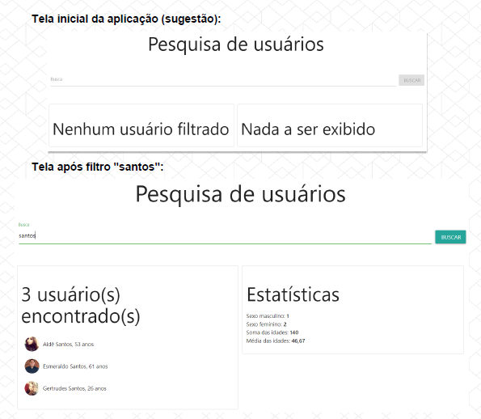
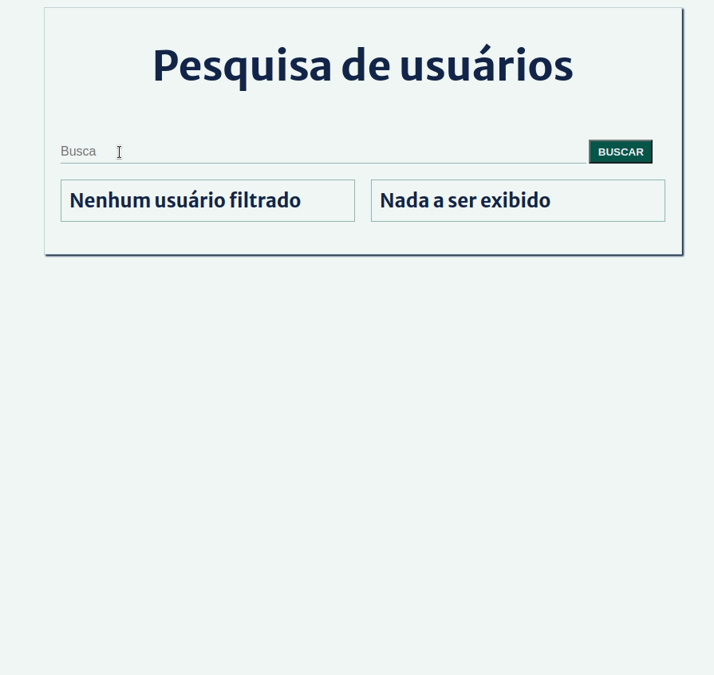

<h1 align="center">Desafio - Módulo 1</h1>
<p align="center">
  
</p>


<p align="center">
  
  
  <a href="license.md">
  
  </a>
</p>

___

<h3 align="center">
  <a href="#information_source-objetivos">Objetivos</a>&nbsp;|&nbsp;
  <a href="#book-especificações">Especificações</a>&nbsp;|&nbsp;
  <a href="#rocket-resultado">Resultado</a>&nbsp;|&nbsp;
  <a href="#interrobang-como-rodar-o-projeto">Rodar o projeto</a>&nbsp;|&nbsp;
  <a href="#license">License</a>&nbsp;|&nbsp;
</h3>

___

<br>
<br>

## :information_source: Objetivos

*Exercitar os seguintes conceitos trabalhados no Módulo:*

✓ Declarar elementos HTML como títulos, input, div, span, ul, li etc.

✓ Estilizar o app com CSS.

✓ Mapear elementos do DOM para serem manipulados com JavaScript.

✓ Formatar valores com JavaScript.

✓ Realizar diversos cálculos com array methods como map, filter e reduce.

✓ Realizar requisições HTTP com o comando fetch.

<br>

## :book: Especificações

<br>

### :pushpin: Enunciado

Criar uma aplicação para filtrar usuários e mostrar estatísticas a partir do filtro definido.

<br>

### :pushpin: Atividades

1. Na carga inicial da aplicação, obter os dados de: https://randomuser.me/api/?seed=javascript&results=100&nat=BR&noinfo
2. Carregar os dados dos usuários em um array.
3. Permitir a filtragem de usuários através de um input com interação do usuário.
4. O usuário poderá filtrar dados quando digitar pelo menos um caractere no input.
5. O usuário poderá filtrar os dados tanto digitando "Enter" quanto clicando no botão correspondente, conforme imagens mais abaixo.
6. Montar dois painéis.
7. No painel da esquerda, listar os usuários filtrados.
8. No painel da direita, calcular e mostrar algumas estatísticas sobre esses usuários, conforme imagens abaixo.

<p align="center">
  
</p>

<br>

### :pushpin: Dicas

1. Após executar a requisição à API, obtenha somente os dados necessários ao app. Esses são: name (first + last), picture, dob.age e gender.
2. Monitore o input com o evento "keyup".
3. Filtrem os dados a partir de qualquer posição no nome, ou seja, o nome "Brenda" (caso exista na API) deve ser retornado se o filtro for "enda".
4. Para filtrar, considere todo o texto em minúsculas. Assim, o filtro "E" trará tanto "Elena" quanto "Helena", caso existam na API.
5. Não faça a “limpeza” do texto, ou seja, devem ser considerados os acentos e caracteres especiais. Portanto, o texto "Andre" não pode filtrar o nome “André”.
6. Dê um console.log() nos dados do evento de digitação e você descobrirá como "cercar" a tecla "Enter".
7. Quebre o seu código em funções bem definidas.
8. Será necessária uma boa dose de manipulação manual do DOM. Isso pode ser feito tanto com innerHTML + string (recomendo a utilização de template literals) ou com os comandos document.createElement, appendChild, etc.

## :rocket: Resultado

<p align="center">
  
</p>

<br>

## :interrobang: Como rodar o projeto

<br>

### Instalar as dependências:

<br>

No terminal:
```bash
yarn
```
<br>

### Rodar o back-end
<br>

No terminal:
```bash
yarn start
```
<br>

### Rodar o front-end

- Abrir diretamente o arquivo `index.html` no browser ou rodar o [live server](https://marketplace.visualstudio.com/items?itemName=ritwickdey.LiveServer) no VSCode.

<br>


## License 

Esse projeto está sob a licença MIT. Veja o arquivo [LICENSE](../../LICENSE) para mais detalhes.
