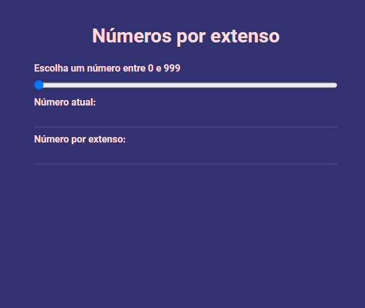

<h1 align="center">Trabalho Prático - Módulo 1</h1>

  

  
  
  

___

<h3 align="center">
  <a href="#information_source-sobre">Sobre</a>&nbsp;|&nbsp;
  <a href="#book-especificações">Especificações</a>&nbsp;|&nbsp;
  <a href="#rocket-resultado>Resultado</a>&nbsp;|&nbsp;
  <a href="#licença">Licença</a>
</h3>

___

 
 

## :information_source: Sobre

Exercitar os conceitos trabalhados no Módulo:
✓ Utilização de elementos HTML.
✓ Utilização de identificadores em elementos HTML.
✓ Captura de referência de elementos com JavaScript.
✓ Manipulação de eventos com JavaScript.
✓ Utilização de funções com JavaScript.

## :book: Especificações

 

### :pushpin: Enunciado

Construir, utilizando HTML, CSS e JavaScript puro, uma aplicação para mostrar números por extenso.

 

### :pushpin: Atividades

1. Implementar, através de HTML, CSS e JavaScript puro, uma aplicação que deve, a partir de um número definido pelo usuário (entre 0 e 999, inclusive), mostrar como é a descrição do número, ou seja, o número por extenso.

2. A aplicação deve conter 3 inputs.  
  a. O primeiro input deve ser do tipo range e permitir a mudança de valores entre 0 e 999 (inclusive).  
  b. O segundo input deve ser textual, desabilitado e somente-leitura. Este input deve mostrar o número selecionado do range em formato numérico. 
  c. O terceiro input deve ser textual, desabilitado e somente-leitura. Este input deve mostrar o número selecionado do range em formato por extenso.

3. A imagem abaixo ilustra uma possível interface para a aplicação.

 

### :pushpin: Dicas

- Utilize o método load de window.addEventListener para garantir que o DOM esteja totalmente carregado antes de qualquer instrução JavaScript. Como uma alternativa mais declarativa, pesquise e veja como utilizar o atributo defer na tag `<script>`.
- Utilize id's nos inputs para mapeá-los no script com document.querySelector.
- Utilize o evento input para mapear a mudança de valores no input do tipo range.
- Crie funções para tratar números com 1, 2 e 3 caracteres. Faça reuso dessas funções.

## :rocket: Resultado

  

 

## Licença 

Esse projeto está sob a licença MIT. Veja o arquivo [LICENSE](../../LICENSE) para mais detalhes.
