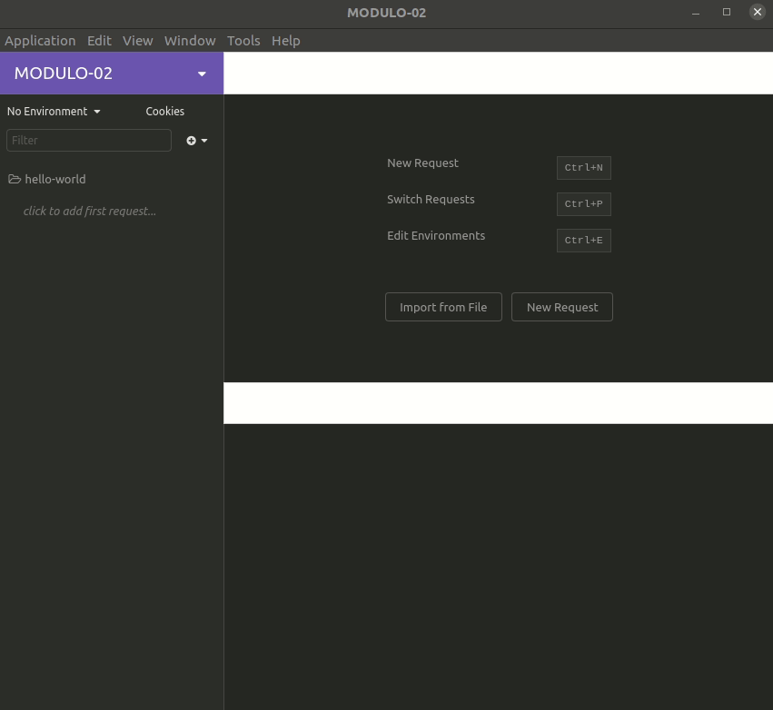

<h1 align="center">ExpressJS</h1>
<p align="center">
  
</p>


<p align="center">
  
  
  <a href="license.md">
  
  </a>
</p>

___

<h3 align="center">
  <a href="#information_source-sobre">Sobre</a>&nbsp;|&nbsp;
  <a href="#book-especificações">Aulas</a>&nbsp;|&nbsp;
  <a href="#rocket-resultado>Resultado</a>&nbsp;|&nbsp;
  <a href="#licença">Licença</a>
</h3>

___

<br>
<br>

## :information_source: Sobre

Criação do primeiro `Hello World` em [NodeJS](https://nodejs.org/en/), utilizando o [ExpressJS](https://expressjs.com/pt-br/).

## :book: Aulas

<br>

### :pushpin: ExpressJS

ExpressJS é um framework web para o Node.js. Ele provê várias funcionalidades, que fazem o desenvolvimento de aplicações mais rápido e fácil ao comparado com o desenvolvimento somente com o Node.js. Em seu site, ele se autodescreve com um framework web rápido, flexível e minimalista para o Node.js.
Existem várias vantagens na utilização do Express para os projetos do back-end. Ele facilita o roteamento da aplicação baseado nos métodos HTTP e URLs. Roteamento refere-se à definição de endpoints (URIs) e como eles respondem às solicitações do cliente.

<br>

### :pushpin: Nodemon

Uma biblioteca muito útil para trabalhar com desenvolvimento em Node.js é a [Nodemon](https://nodemon.io/). Após realizar sua instalação utilizando o NPM e inicializar o projeto utilizando ela, ela então passa a monitorar o mesmo, e quando identifica alguma alteração ela automaticamente para e inicia a aplicação, facilitando assim o fluxo de desenvolvimento.

<br>

### :pushpin: Instalação

<br>

Para instalar o Express, primeiro é necessário iniciar um projeto Node e depois o Express será adicionado como dependência neste projeto.

:arrow_right: *iniciar o node*
```
npm init -y
```

ou

```
yarn init -y
```

:arrow_right: *instalar o ExpresJS*
```
npm install express
```

ou

```
yarn add express
```

:arrow_right: *instalar o Nodemon*
```
npm install nodemon
```

ou

```
yarn add nodemon
```
### :pushpin: Rodar o servidor

Para rodar o projeto criado utilizar o comando `nodemon index.js`.

Uma outra forma é criar um script dentro do `package.json` e rodar o comando no terminal. Esta foi a forma utilizada neste projeto, criando o script `start`.

Para inicializar: 

```bash
npm start
```

ou

```bash
yarn start
```

:arrow_right: *package.json*


<br>

### :pushpin: Insomnia

O [insomnia](https://insomnia.rest/) é um aplicativo multiplataforma open source criado para facilitar a iteração com APIs baseadas no protocolo HTTP.

Essa aplicativo foi utilizado para testar se as rotas `get` e `post` utilizadas no exemplo estão funcionando.


## :rocket: Resultado

:arrow_right: *terminal*


:arrow_right: *insomnia*



<br>

## Licença 

Esse projeto está sob a licença MIT. Veja o arquivo [LICENSE](../../LICENSE) para mais detalhes.
