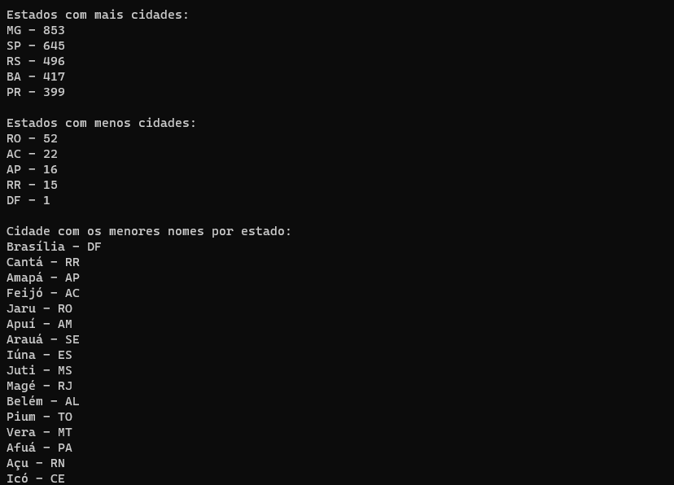

<h1 align="center">Trabalho Prático - Módulo 2</h1>

  

  
  
  

___

<h3 align="center">
  <a href="#information_source-sobre">Sobre</a>&nbsp;|&nbsp;
  <a href="#book-especificações">Especificações</a>&nbsp;|&nbsp;
  <a href="#rocket-resultado>Resultado</a>&nbsp;|&nbsp;
  <a href="#licença">Licença</a>
</h3>

___

 
 

## :information_source: Sobre

Exercitar os conceitos trabalhados no Módulo:
✓ Criação de um projeto Node.js
✓ Manipulaçã de arquivos
✓ Manipulação de objetos JSON

## :book: Especificações

 

### :pushpin: Enunciado

Criação  de um projeto Node.js para realizar a criação de alguns métodos e processamento de arquivos JSON.

 

### :pushpin: Atividades

1. Criar uma função que irá criar um arquivo JSON para cada estado representado no arquivo Estados.json, e o seu conteúdo será um array das cidades pertencentes a aquele estado, de acordo com o arquivo Cidades.json. O nome do arquivo deve ser o UF do estado, por exemplo: MG.json.

2. Criar uma função que recebe como parâmetro o UF do estado, que realize a leitura do arquivo JSON correspondente e que retorne a quantidade de cidades daquele estado.

3. Criar um método que imprima no console um array com o UF dos cinco estados que mais possuem cidades, seguidos da quantidade, em ordem decrescente. Você pode usar a função criada no tópico 2. Exemplo de impressão: [“UF - 93”, “UF - 82”, “UF - 74”, “UF - 72”, “UF - 65”]

4. Criar um método que imprima no console um array com o UF dos cinco estados que menos possuem cidades, seguidos da quantidade, em ordem decrescente. Você pode usar a função criada no tópico 2. Exemplo de impressão: [“UF - 30”, “UF - 27”, “UF - 25”, “UF - 23”, “UF - 21”]

5. Criar um método que imprima no console um array com a cidade de maior nome de cada estado, seguida de seu UF. Por exemplo: [“Nome da Cidade – UF”, “Nome da Cidade – UF”, ...].

6. Criar um método que imprima no console um array com a cidade de menor nome de cada estado, seguida de seu UF. Por exemplo: [“Nome da Cidade – UF”, “Nome da Cidade – UF”, ...].

7. Criar um método que imprima no console a cidade de maior nome entre todos os estados, seguido do seu UF. Exemplo: “Nome da Cidade - UF".

8. Criar um método que imprima no console a cidade de menor nome entre todos os estados, seguido do seu UF. Exemplo: “Nome da Cidade - UF".

 

### :pushpin: Observações

- Nos itens que tratam a respeito do tamanho do nome da cidade, em caso de empate no tamanho entre várias cidades, você deve considerar a ordem alfabética para ordenar as cidades pelo seu nome, e então retornar a primeira cidade.

- Ao rodar o projeto, ele deve executar os métodos em sequência e depois finalizar a execução.

## :rocket: Resultado

  

 

## Licença 

Esse projeto está sob a licença MIT. Veja o arquivo [LICENSE](../../LICENSE) para mais detalhes.
