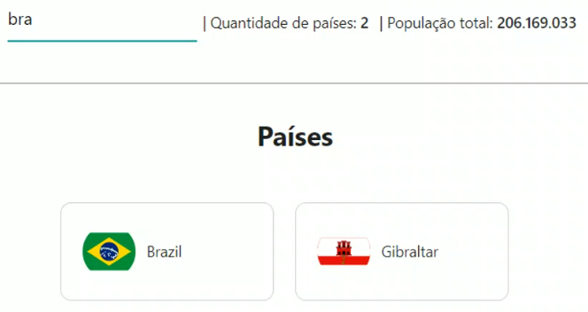

<h1 align="center">Desafio 02</h1>

  

  
  
  

___

<h3 align="center">
  <a href="#information_source-sobre">Sobre</a>&nbsp;|&nbsp;
  <a href="#book-roteiro">Roteiro</a>&nbsp;|&nbsp;
  <a href="#heavy_check-mark-resultado">Resultado</a>&nbsp;|&nbsp;
  <a href="#licença">Licença</a>
</h3>

___

 
 

## ℹ️ Sobre

Criação de um app para listar países a partir da API [Restcountries](https://restcountries.eu/rest/v2/all.) 
- Input para filtrar os países 
- Exibir quantidade de países e soma da população dos países filtrados. 

### 📌 Modelo

 

### 📌 Observações

- Para monitorar inputs com React, é importante definir os atributos value e onChange.
- Funções simples, comuns a diversos componentes, podem se situar em módulos isolados (helpers). Assim, são mais facilmente reaproveitados.

 

## 📖 Roteiro

✔ Criar projeto a partir do projeto base 
✔ Em *App.js*, criar state com `countries: []` 
✔ Em *App.js*, buscar todos os países em `componentDidMount` e filtrar os dados que de fato interessam. URL: https://restcountries.eu/rest/v2/all 
✔ Criar componente *Countries* para listar os países 
✔ Criar componente *Country* para exibir cada país 
✔ Criar componente *Header* que vai incluir `input` e `labels` 
✔ Fazer com que `input` filtre os dados de países 
✔ Fazer com que os `labels` reajam ao filtro 
✔ Criar pasta *'helpers'* com o arquivo `formatHelpers`.js 
✔ Criar função para formatar valores a partir de `Intl` 
✔ Estilizar o app 

## ✔️ Resultado :check

  

## Licença 
Esse projeto está sob a licença MIT. Veja o arquivo [LICENSE](../../LICENSE) para mais detalhes.
