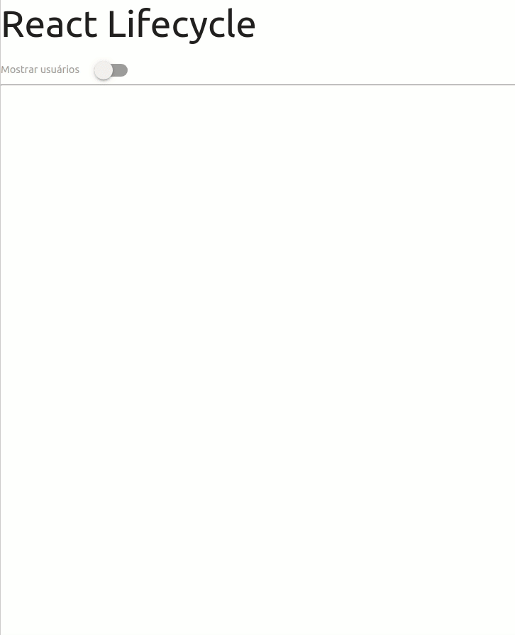

<h1 align="center">React Lifecycle</h1>

  

  
  
  

___

<h3 align="center">
  <a href="#information_source-sobre">Sobre</a>&nbsp;|&nbsp;
  <a href="#book-roteiro">Roteiro</a>&nbsp;|&nbsp;
  <a href="#heavy_check_mark-resultado">Resultado</a>&nbsp;|&nbsp;
  <a href="#licença">Licença</a>
</h3>

___

 
 

## ℹ️ Sobre

Criação de um projeto de um botão que quando clicado mostra uma lista. Caso esteja ativado mostrará quanto tempo a lista está em tela.

Esse projeto demonstra o uso dos 3 principais métodos do ciclo de vida do Class Component no React. 

- **componentDidMount** – executado após o primeiro render() e útil para requisições HTTP, por exemplo.
- **componentDidUpdate** – executado após toda invocação de render() e útil para aplicação de “efeitos colaterais”.
- **componentWillUnmount** – executado antes do componente “morrer” e útil para finalização de objetos, como por exemplo clearInterval.

Para mais informações sobre os ciclos de vida de Class Components no React, acesse este [link](https://reactjs.org/docs/react-component.html#the-component-lifecycle).

## 📖 Roteiro

✔ Criar projeto de nome react-lifecycle 
✔ Em *App.js*, colocar `console.log` em `componentDidMount`, `componentDidUpdate` e `componentWillUnmount` 
✔ Em *App.js*, criar estado com um vetor de `users []` e boolean `showUsers` false 
✔ Em `componentDidMount` de *App.js*, preencher vetor de `users` com [fetch](https://randomuser.me/api/?seed=rush&nat=br&results=10) 
✔ No render de *App.js*, mostrar botão para exibir `users` conforme valor de `showUsers` 
✔ Criar componente `Users` 
✔ Listar usuários através de `props` de forma simples, por enquanto 
✔ Em *Users.js* colocar `console.log` em `componentDidMount`, `componentDidUpdate` e `componentWillUnmount` 
✔ Em *Users.js*, criar estado para indicar por quantos segundos o componente está visível em tela (ex: secondsVisible: 0) 
✔ Em *Users.js*, criar atributo `this.interval` no *construtor* 
✔ Em *Users.js*, `componentDidMount`, ativar interval de 1 segundo para incrementar `secondsVisible` 
✔ Ao executar a aplicação, clicar no botão para esconder novamente os usuários e verificar `componentWillUnmount` de Users 
✔ Corrigir erro com `clearTimeout`. 
✔ Estilizar app. 

## ✔️ Resultado

  

## Licença 
Esse projeto está sob a licença MIT. Veja o arquivo [LICENSE](../../LICENSE) para mais detalhes.
