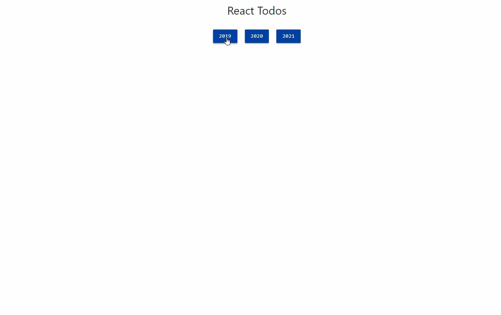

<h1 align="center">Desafio - Módulo 03</h1>

  

  
  
  

___

<h3 align="center">
  <a href="#information_source-objetivos">Objetivos</a>&nbsp;|&nbsp;
  <a href="#book-especificações">Especificações</a>&nbsp;|&nbsp;
  <a href="#interrobang-como-rodar-o-projeto">Rodar o projeto</a>&nbsp;|&nbsp;
  <a href="#license">License</a>&nbsp;|&nbsp;
</h3>

___

 
 

## ℹ️ Sobre

Exercitar os seguintes conceitos trabalhados no Módulo:
- Implementação de algoritmos com JavaScript.
- Criação de componentes com React.
- Utilização de React Hooks.
- Consumo de um Backend.

## 📖 Especificações

 

### :pushpin: Enunciado

Criação de uma aplicação com React para visualizar tarefas cumpridas/não cumpridas baseando-se em ano/mês, com a possibilidade de cumprir/descumprir tarefas.

 

### :pushpin: Atividades

1. Defina uma pasta base para englobar o backend e frontend.
2. Converta o projeto base para utilizar Functional Components com Hooks.
3. Instale o **backend** fornecido. O *backend* consiste no arquivo `backend.json`, servido pelo pacote `json-server`. Para instalar, basta descompactar a pasta backend dentro da pasta base, acessá-la via terminal de comandos e executar `npm install` ou `yarn`. Assim, todas as dependências serão instaladas. Para executar o *backend*, digite o comando `npm start` ou `yarn start`. O *backend* será executado na porta `3001`, e poderá ser acessado através de `http://localhost:3001/todos`.
4. A interface  é livre.
5. Implementação opcional: ao clicar em uma tarefa, cumpri-la ou descumpri-la, refletindo a ação tanto no **backend** quanto no **frontend**.

 

### :pushpin: Demonstração

  

 

### :pushpin: Sugestões

1. A demonstração foi baseada no Materialize CSS.

2. Isolar todo o comportamento de comunicação com o *backend* em um arquivo separado, como por exemplo `./api/api.js`.

3. Alguns exemplos de estado da aplicação - `React.useState`, concentrado em App.js:
- selectedYear
- selectedMonth
- selectedTodos

4. Utilizar `React.useEffect` para monitorar `selectedYear` e `selectedMonth` para realizar o filtro das tarefas corretamente.

5. Utilizar meses e anos fixos. Os anos das tarefas são 2019, 2020 e 2021.

6. Para filtrar tarefas por mês e ano, utilizar a seguinte URL como exemplo, que filtra as tarefas de março/2020: `http://localhost:3001/todos?year=2020&month=3`

7. Os componentes referentes aos botões de anos e meses podem ser reaproveitados, bastando modificar suas `props`.

8. Dividir a aplicação nos seguintes componentes, dentro de` <App />`:

- `<ButtonContainer />` e `<Button />` para os botões de anos e meses.
- `
` para o sumário dos dados.
- `<Todos />` e `<Todo />` para a listagem de tarefas.

 

## Licença 
Esse projeto está sob a licença MIT. Veja o arquivo [LICENSE](../../LICENSE) para mais detalhes.
