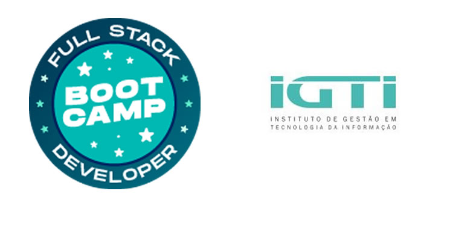

<h1 align="center">React Lifecycle - Hooks</h1>

  

  
  
  

___

<h3 align="center">
  <a href="#information_source-sobre">Sobre</a>&nbsp;|&nbsp;
  <a href="#book-roteiro">Roteiro</a>&nbsp;|&nbsp;
  <a href="#licença">Licença</a>
</h3>

___

 
 

## ℹ️ Sobre

Conversão do projeto de Class Components em Functional Components com Hooks.

## 📖 Roteiro

✔ Converter componente Users

✔ Converter componente App

## Licença 
Esse projeto está sob a licença MIT. Veja o arquivo [LICENSE](../../LICENSE) para mais detalhes.
