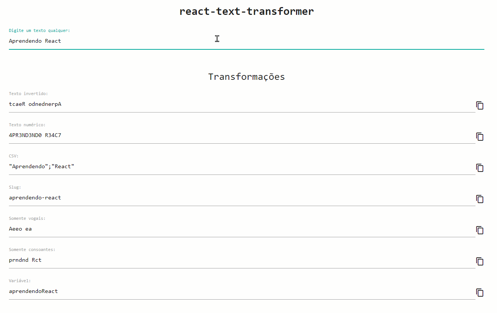

<h1 align="center">Trabalho Prático</h1>

  

  
  
  

___

<h3 align="center">
  <a href="#information_source-sobre">Sobre</a>&nbsp;|&nbsp;
  <a href="#book-especificações">Especificações</a>&nbsp;|&nbsp;
  <a href="#licença">Licença</a>
</h3>

___

 
 

## ℹ️ Sobre

Trabalho prático com o intuito de exercitar os seguintes conceitos trabalhados no Módulo:
- Implementação de aplicações com JavaScript e React.
- Criação de Class Components.
- Utilização da API de Área de Transferência (opcional).

## 📖 Especificações

 

### 📌 Enunciado

Construir, utilizando React e Class Components, uma aplicação para realizar a transformação de textos.

 

### 📌 Atividades

- Implementar, utilizando React e preferencialmente Class Components, uma aplicação denominada “react-text-transformer” que possuirá um input editável e diversos outros inputs somente-leitura, para exibir transformações a partir do texto informado pelo usuário. As transformações a serem realizadas são:
  - Texto invertido.
  - Texto numérico, com as seguintes regras:
    - Texto convertido para maiúsculas.
    - Texto com remoção de acentos (opcional).
    - Troca de O por 0 (zero).
    - Troca de L por 1.
    - Troca de E por 3.
    - Troca de A por 4.
    - Troca de S por 5.
    - Troca de T por 7.
  - Texto no formato CSV, com as seguintes regras:
    - Cada palavra deve ser envolvida por aspas duplas.
    - As palavras devem ser separadas por ponto-e-vírgula.
  - Slug, com as seguintes regras:
    - Texto em minúsculas.
    - Texto com remoção de acentos (opcional).
    - Cada palavra deve ser separada por hífen.
  - Somente vogais, preservando os espaços em branco.
  - Somente consoantes, preservando os espaços em branco.
  - Formato de variável (camelCase), com as seguintes regras.
    - Texto com remoção de acentos (opcional).
    - Primeira palavra totalmente em minúsculas.
    - Demais palavras em minúsculas com o primeiro caractere maiúsculo.
- Implementar, opcionalmente, uma funcionalidade que permite que o usuário copie
o texto transformado para a Área de Transferência. Mais informações podem ser
obtidas aqui.
- A imagem abaixo ilustra um exemplo de implementação. Será também
disponibilizado um vídeo no formato .gif no Fórum de Avisos.

 

### 📌 Observações

- A aplicação será implementada com um atributo no objeto de `this.state` em App.js => `userInput`.

- Criar o componente `<Input />` e tonrá-lo customizável. Na minha implementação, criar as *props* `readOnly` e `allowCopy`. Todos os inputs da imagem acima são instâncias do componente `<Input />` com variações nestas *props*.

- As implementações da remoção de acentos e da funcionalidade de cópia do texto são opcionais.

- Utilizar array methods, como `map`, `filter`, `split`, `join` e `reverse`. É possível criar um array de objetos que comporte todas as transformações, além de id e descrição. Assim, é possível iterar a criação dos componentes de forma dinâmica com array.map.

 

## Licença 
Esse projeto está sob a licença MIT. Veja o arquivo [LICENSE](../../LICENSE) para mais detalhes.
