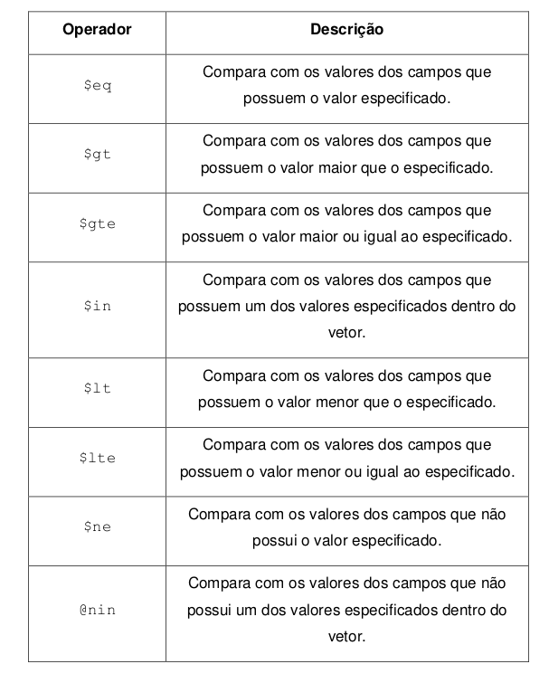
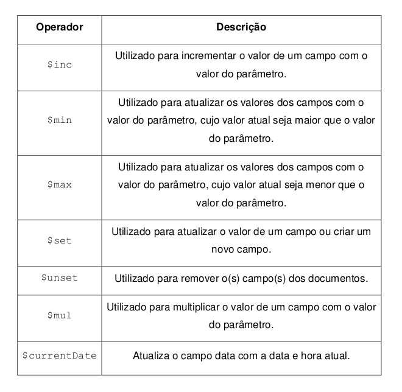
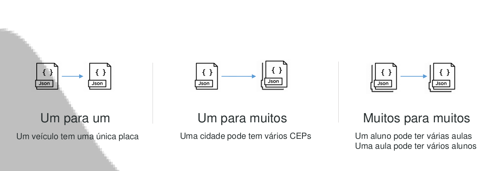

<h1 align="center">Capítulo 01 - Introdução ao MongoDB</h1>
<p align="center">
  
</p>

<p align="center">
  
  
  <a href="license.md">
  
  </a>
</p>

___

<br>

# Índice

- [Introdução](#interrobang-introdução)
  - [Inicializar MongoDB](#book-inicializar-mongodb)
  - [Banco de Dados](#book-banco-de-dados)
  - [Coleções](#book-coleções)
- [CRUD](#interrobang-crud)
  - [Create](#book-create)
  - [Retrieve](#book-retrieve)
  - [Update](#book-update)
  - [Delete](#book-delete)
- [Outros](#interrobang-outros)
  - [BulkWrite](#book-bulkwrite)
  - [[Indices]](#book-índices)
  - [Modelagem](#book-modelagem)
  - [Agregações](#book-agregações)
- [Licença](#licença)


___

<br>

# ⁉️ Introdução

<br>


## 📖 Inicializar MongoDB

<br>

### 📌 Terminal 1

`mongod --dbpath="ENDEREÇO DA PASTA"`

<br>

### 📌 Terminal 2

`mongo --host localhost:27017`

<br>

---

<br>

## 📖 Banco de Dados

<br>

### 📌 Principais Comandos:
- `db.help()`
- `show dbs`
- `db`
- `use nomeDB`
- `db.dropDatabase()`

<br>

#### 📌 Exemplos:

```bash
use grades
```

```bash
use students
```

```bash
db.dropDatabase(students)
```
<br>

---
<br>

## 📖 Coleções

<br>

### 📌 Principais Comandos:
- `db.createCollection(name,options)`
- `show collections`
- `db.COLLECTION.drop()`

<br>

### 📌 Exemplos:

```bash
db.createCollection("student")
```

```bash
db.createCollection("students")
```

```bash
db.createCollection("log", {capped, size: 1025, max: 10})
```

```bash
db.students.drop()
```

<br>
---

<br>

# ⁉️ CRUD

<br>

## 📖 Create

<br>

### 📌 Principais Comandos:
- `db.COLLECTION.insertOne()`
- `db.COLLECTION.insertMany()`
- `db.COLLECTION.insert()`

<br>

### 📌 Exemplos:

```bash
db.student.insertOne({name: "Maria dos Anjos"})
```

```bash
db.student.insertMany([
  {name: "Maria Clara", subject: "Matemática", type: "Trabalho Prático", value: 15.4},
  {name: "Ana Maria Silva", subject: "Portugues", type: "Prova Final", value: 23.8}
])
```

```bash
db.student.insert({name: "Pedro Augusto", subject: "Historia"})
```

```bash
db.student.insert([
  {name: "Paulo Jose", subject: "Historia", type: "Trabalho Pratico", value: 17.5}, 
  {name: "Claudia Romualdo", subject: "Quimica", type: "Prova Final", value: 28.5}
])
```

<br>

---

<br>

## 📖 Retrieve

<br>

### 📌 Principais Comandos:
- `db.COLLECTION.find(query,projection)`
- `db.COLLECTION.findOne(query,projection)`
- `db.COLLECTION.find().limit(n)`
- `db.COLLECTION.find().skip(n)`
- `db.COLLECTION.find().pretty()`
- `db.COLLECTION.find().sort({field:1,field:-1)`

<br>

### 📌 Exemplos Projection:

```bash
db.student.find()
```

```bash
db.student.find({}, {_id:0, name:1, value:1})
```

```bash
db.student.find({}, {_id:0, name:1, value:1}).limit(2)
```

```bash
db.student.find({}, {_id:0, name:1, value:1}).limit(5).skip(1)
```

```bash
db.student.find({}, {_id:0, name:1, value:1}).sort({name:1})
```

```bash
db.student.find().pretty()
```

<br>

### 📌 Definição das Query's
<br>

#### 📎 Adição de novos dados

```bash
db.student.insertMany([
  {name: "Victor Novaes", subject: "Protugues", type: "Trabalho Pratico", value: 15.8}, 
  {name: "Pedro Henrique", subject: "Fisica", type: "Prova Final" ,value: 12.9}, 
  {name: "Fernanda Tolentino", subject: "Matematica", type: "Trabalho Pratico", value: 19}, 
  {name: "Antonia Alvarenga", subject: "Historia", type: "Prova Intermediária", value: 12}, 
  {name: "Gustavo Felipe Amorim", subject: "Quimica", type: "Prova Final", value: 10}, 
  {name: "Gustavo Felipe Amorim", subject: "Quimica", type: "Trabalho Pratico", value: 16}
])
```

<br>

#### 📎 Comando básico
```bash
db.student.find({subject: "Quimica"}, {_id:0}).pretty()
```

<br>

#### 📎 Operadores lógicos:


```bash
db.student.find({$and: [{subject: "Quimica"}, {type: "Prova Final"}]}, {_id:0}).pretty()
```

```bash
db.student.find({$nor: [{subject: "Quimica"}, {type: "Prova Final"}]}, {_id:0}).pretty()
```

```bash
db.student.find({$or: [{subject: "Quimica"}, {subject: "Matematica"}]},{_id:0}).pretty()
```

<br>

#### 📎 Operadores de Comparação



```bash
db.student.find({value: {$gt: 20}}, {_id:0}).pretty()
```

```bash
db.student.find({subject: {$in: ["Quimica", "Matematica"]}}, {_id:0}).pretty()
```

<br>

---

<br>

## 📖 Update

<br>

### 📌 Principais Comandos:
- `db.COLLECTION.updateOne(query,update,options)`
- `db.COLLECTION.updateMany(query, update, options)`
- `db.COLLECTION.replaceOne(query, update, options)`



<br><br>

### 📌 Exemplos

```bash
db.student.updateOne({name: "Ana Maria Silva", subject: "Portugues"},{$set: {type: "Trabalho Pratico"}})
```

```bash
db.student.updateOne({name: "Pedro Augusto", subject: "Historia"},{$set: {type: "Prova Final"}})
```

```bash
db.student.updateOne({name: "Pedro Augusto", subject: "Historia"},{$inc: {value: 10}})
```

```bash
db.student.updateMany({subject: "Matematica", type: "Trabalho Pratico"}, {$inc: {value: 2}})
```

```bash
db.student.updateMany({},{$currentDate: {lastModified: true, timestamp: {$type: "timestamp"}}})
```

```bash
db.student.updateMany({}, {$unset: {timestamp:1}})
```

```bash
db.student.replaceOne(
  {_id: ObjectId("600da19a511b7af1ed6b5e49")}, 
  {name: "Lucas Pereira", subject: "Fisica", type: "Prova Final", value: 15.4, lasModified: new Date()})
```

<br>

---

<br>


## 📖 Delete

<br>

### 📌 Principais Comandos:
- `db.COLLECTION.deleteOne(filter)`
- `db.COLLECTION.deleteMany(filter)`

<br>

### 📌 Exemplos

```bash
db.student.deleteOne({_id: ObjectId("600da19a511b7af1ed6b5e49")})
```

```bash
db.student.deleteMany({subject: "Fisica"})
```
<br>

---

<br>

# ⁉️ Outros

<br>

## 📖 BulkWrite

<br>

### 📌 Comando:
`db.COLLECTION.bulkWrite([operacao1, operacao2,...], options)`

<br>

### 📌 Exemplos

```bash
db.student.bulkWrite([
  {
    insertOne: {
    "document": {
      name: "Thiago Ventura", 
      subject: "Fisica", 
      type: "Prova Final", 
      value: 16, 
      typestamp: new Date()}
    }
  },
  {
    insertOne: {
    "document": {
      name: "Patricia Rafaela", 
      subject: "Portugues", 
      type: "Trabalho Pratico", 
      value: 21.3, 
      typestamp: new Date()}
    }
  },
  {
    updateOne: {
      "filter": {_id: ObjectId("600da270511b7af1ed6b5e4b")},
      "update": {$set: {subject: "Historia"}}
    }
  },
  {
    deleteOne: {
      "filter": {_id: ObjectId("600da352511b7af1ed6b5e4d")}
    }
  },
  {
    replaceOne: {
      "filter": {_id: ObjectId("600da352511b7af1ed6b5e4e")},
      "replacement": {
        name: "Tais Bernardes", 
        subject: "Fisica", 
        type: "Trabalho Pratico", 
        value: 12, 
        lastModified: new Date()
      } 
    }
  }
], {oerdered: false})
```
<br>

---

<br>

## 📖 Índices

<br>

### 📌 Definição

- Estruturas de dados especiais que armazenam o valor de um campo específico ou conjunto de campos, ordenado pelo valor dos campos nos quais
o índice foi criado.

- Pode facilitar e melhor a busca de documentos dentro da coleção.

<br>

### 📌 Principais Comandos:
- `db.COLLECTION.createIndex({campo: 1})`
- `db.COLLECTION.getIndexes()`
- `db.COLLECTION.dropIndex()`

<br>

### 📌 Exemplos

```bash
db.student.getIndexes()
```

```bash
db.student.createIndex({name: -1})
```

```bash
db.student.dropIndex("name_-1")

or

db.student.droIndex({name: -1})
```
<br>

---

<br>

## 📖 Modelagem

<br>

### 📌 Definição

- Os tipos de relacionamentos definem qual a estratégia de modelagem que será utilizada.

- Se será colocado tudo dentro de um único arquivo ou se será separado em documentos de outras coleções.

<br>

### 📌 Tipos de relacionamento



<br><br>

### 📌 Tipos de modelagem:

- *Dados imbutidos* => os dados estão todos na mesma estrutura do documento. Esses modelos de dados possibilitam que as aplicações consultem e atualizem os dados relacionados numa única operação.

- *Dados referenciados* => a estrutura do documento segue o princípio dos bancos relacionais no qual os dados são referenciados por chave primária/estrangeira.

<br>

---

<br>

## 📖 Agregações

### 📌 Definição

- Agregações é o processo que retorna os resultados computados de acordo com a operação. As operações de agregação podem agrupar valores de vários documentos e executar várias operações nos dados agrupados para retornar um resultado.

### 📌 Principais Comandos:
- `db.COLLECTION.aggregate()`
- `db.COLLECTION.count(query)`
- `db.COLLECTION.countDocuments(query)`
- `db.COLLECTION.distinct(field, query)`

<br>

### 📌 Aggregate
```bash
db.COLLETICON.aggregate([
  {$project: {}},
  {$match: { campo: "X" }},
  {$group: {_id: "$campo", total: {$sum: "$campo"}}},
  {$sort: {}},
  {$skip: N},
  {$limit: N}
])
```

- `$project`: utilizada para definir os campos que serão carregados do documento.
- `$match`: utilizada para filtrar os documentos que serão utilizados na agregação.
- `$group`: utilizada para realizar a agregação com operações de agregação que serão vistas mais à frente (sum, abs, avg,...).
- `$sort`: utilizada para realizar a ordenação do resultado apresentado.
- `$skip`: utlizada para pular os documentos que não serão agregados.
- `$limit`: utilizada para limitar o número de documentos que serão agregados.

#### ▶️ Soma
```bash
db.student.aggregate([
  {$group: {_id: null, total: {$sum: "$value"}}}
])
```

```bash
db.student.aggregate([
  {$match: { subject: "Historia"}},
  {$group: {_id: null, total: {$sum: "$value"}}}
])
```

```bash
db.student.aggregate([
  {$match: { subject: "Historia"}},
  {$group: {_id: {subject: "$subject", type: "$type"}, total: {$sum: "$value"}}}
])
```

```bash
db.student.aggregate([
  {$group: {_id: {subject: "$subject", type: "$type"}, total: {$sum: "$value"}}},
  {$sort: {_id: 1}}
])
```

#### ▶️ Média
```bash
db.student.aggregate([
  {$group: {_id: null, total: {$avg: "$value"}}}
])
```

### 📌 Count

```bash
db.student.count({subject: "Matematica"})
```

```bash
db.student.count({subject: "Historia", value: {$gt: 10}})
```

### 📌 countDocuments

```bash
db.student.countDocuments({subject: "Historia"})
```

### 📌 Distinct

```bash
db.student.distinct("subject")
```

```bash
db.student.distinct("subject").sort()
```

## Licença 
Esse projeto está sob a licença MIT. Veja o arquivo [LICENSE](../../LICENSE) para mais detalhes.