<h2 align="center">Desafio Final Bootcamp</h2>
<p align="center">
  
</p>

<p align="center">
  
  
  <a href="license.md">
  
  </a>
</p>

___

<h3 align="center">
  <a href="#information_source-objetivos">Objetivos</a>&nbsp;|&nbsp;
  <a href="#book-enunciado">Enunciado</a>&nbsp;|&nbsp;
  <a href="#book-atividades">Atividades</a>&nbsp;|&nbsp;
  <a href="#licença">Licença</a>
</h3>

___

<br>

# ℹ️ Objetivos

Exercitar os seguintes conceitos trabalhados nos Módulos 01 a 04:<br>
✔️ Implementação de algoritmos com JavaScript.<br>
✔️ Criação de APIs com Node.js e Express.<br>
✔️ Criação de componentes com React com Class Components e/ou Functional Components.<br>
✔️ Persistência de dados com MongoDB e Mongoose.<br>
✔️ Implantação de aplicações web com Heroku.<br>

<br>

# 📚 Enunciado

Criar uma aplicação web para *Controle Financeiro Pessoal* com [MongoDB](https://www.mongodb.com) + [Node.js](https://nodejs.org) + [React](https://pt-br.reactjs.org) e implantação no [Heroku](https://www.heroku.com).

<br>

# 📚 Atividades

<br>

## 📂 Etapa 1 – Criação de Database e Collection no MongoDB e importação dos dados originais:

<br>

### 📌 Pré-requisitos:
- *Node.js* (recomenda-se a versão 12.9.1 ou superior);
- *Yarn* (recomenda-se a versão 1.22.4 ou superior, desde que se mantenha a versão 1.x) em seu computador. 
- Possuir uma conta devidamente criada no serviço *MongoDB Atlas* e já ter criado o seu *Cluster* gratuito. 
- Para não ter problemas com conexões, configurar o *cluster* para aceitar conexões de 0.0.0.0. Isso pode ser feito através da tela "Network Access".

<p align="center"></p><br>

### 📌 Acessar o *Cluster* já criado no *MongoDB Atlas*. Em seguida, acessar a tela de *Collections* e criar um novo *Database*, conforme imagem abaixo. 

    **Database Name** – *DesafioFinalBootcampFullStack*<br>
    **Collection Name** – *transactions*

<p align="center"></p><br>

### 📌 Certificar que tanto o *Database* quanto a *Collection* foram devidamente criados.

<p align="center"></p><br>

### 📌 Acessar a aplicação *Node.js* fornecida `(projeto "mongodb-import")` e executar o comando `yarn` para instalar todas as dependências já definidas em `package.json`. 
- Criar o arquivo `.env` na raiz do projeto e preencher `DB_CONNECTION` com os dados pertinentes ao seu Banco de Dados. 
- As dicas de como preencher o arquivo `.env` estão no arquivo `.env.example`. Há um comentário iniciado por # na linha 1 com um exemplo de preenchimento e um template para ser copiado/colado no arquivo `.env`.

<p align="center"></p><br>

### 📌 Acessar a pasta do projeto `mongodb-import` no terminal de comandos e executar o seguinte comando: `yarn db`. A seguinte saída aparecerá no terminal e os dados originais do projeto serão copiados para o seu Banco de Dados.

<p align="center"></p><br>

### 📌 Confirmar se os dados apareceram na conta no MongoDB Atlas. Recarregar a tela se necessário.

<p align="center"></p><br>

### 📌 Os registros importados foram gerados aleatoriamente através de combinações de descrições, categorias e valores. 
- Ficou definido o período como: todos os meses do ano anterior, ano atual e ano posterior, totalizando ao todo 36 períodos (atualmente: de jan/2019 até dez/2021, inclusive). 
- O código-fonte deste script será disponibilizado.
<br>

### 📌 Observação importante: 
- Na geração do arquivo original, houve uma pequena falha
e alguns registros com a descrição “Receita xyz...” foram criados como despesa.
- Considerar que as receitas são os registros com type `=== '+'` e as despesas são os registros com o type `=== '-'`. Desconsiderem a descrição. 
<br>

## 📂 Etapa 2 – Implementação do Back End:

<br>

#### 📌 Utilizar como base o projeto app-vazio, que será disponibilizado. 
<br>

#### 📌 Acessar a pasta app-vazio após a extração em alguma pasta ne renomear para app.
<br>

#### 📌 Acessar a pasta app através de um terminal de comandos e digite o comando `yarn` para instalar as dependências.
<br>

#### 📌 Verificar, estudar e entender as pastas e arquivos já contidos neste projeto:
<br>

<p align="center"></p><br>

✔️ `Pasta client`: contém o projeto *React* (Front End). <br>
✔️ `Pasta models`: contém o arquivo `TransactionModel.js`, referente ao *Schema Mongoose* para a *Collection transaction*. Este arquivo já foi implementado entretanto, nada impede a modificação e adaptação.<br>
✔️ `Pasta routes`: contém o arquivo `routes.js` e deve conter as rotas, que deverão ser implementadas. <br>
✔️ `Pasta services`: contém o arquivo `transactionService.js` e deve conter a persistência de dados com o *MongoDB*, a ser também implementado. <br>
✔️ `Arquivo .env`: deverá ser criado e conter a String de conexão ao *MongoDB* `DB_CONNECTION`, assim como foi feito na etapa anterior.<br>
✔️ `Arquivo .npmrc`: contém uma configuração do NPM que faz com que as dependências sejam instaladas em sua versão exata (*save-exact*). Isso garante, em regra, mais estabilidade de apps em produção.<br>
✔️ `Arquivo index.js`: é onde tudo começa. Já há uma implementação de configurações do express e da conexão com o *MongoDB*. Basta garantir que a String `DB_CONNECTION` esteja devidamente preenchida no arquivo `.env`.

<br>

### 📌 Verificar, estudar e entender mais alguns detalhes importantes sobre o arquivo `index.js`:

<p align="center"></p><br>

Este trecho de código faz com que o express hospede o React de produção (após o build).

<p align="center"></p><br>

Este trecho de código faz com que a API principal do Back End (transaction) fique hospedada em `http://"meu_site_no_heroku".herokuapp.com/api/transaction`

<p align="center"></p><br>

Neste trecho de código perceba que foi priorizado o valor de `process.env.PORT` para ser utilizado como porta do servidor de Back End. Isso será utilizado pelo Heroku
em produção. Em desenvolvimento, será adotada a porta `3001`, pois não há a variável `PORT` no arquivo `.env` local.

<br>

### 📌 Verificar, estudar e entender alguns detalhes importantes sobre o arquivo `package.json`:

<p align="center"></p><br>

Para executar o servidor local, digite `yarn server`, que irá utilizar o *Nodemon* para tal.<br>
O script `heroku-postbuild` será utilizado pelo *Heroku CLI* para realizar o build da aplicação *React*. 

<p align="center"></p><br>

Configuração importante do *Nodemon* para que ele não "escute" a pasta do *React*, pois ela já tem um servidor próprio de desenvolvimento. Sem isso, qualquer alteração no
projeto *React* acarreta no reinício do servidor de Back End durante o desenvolvimento, o que não é desejável.

<p align="center"></p><br>

Configuração importante do Heroku para que ele utilize a mesma versão do *Node.js* de desenvolvimento em produção. Se a sua versão do *Node.js* for diferente de 12.9.1, faça a devida alteração nesse objeto de `package.json` e informe a versão que você está utilizando. Recomenda-se, entretanto, utilizar a versão 12.9.1.

<br>

### 📌 Ainda na pasta raiz do projeto, executar `yarn server` para inicializar o Back End de desenvolvimento. Serão exibidas as seguintes mensagens no console:

<p align="center">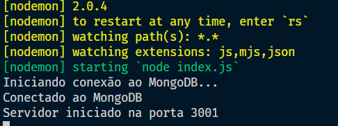</p><br>

### 📌 Observação muito importante: 
- o GET de transaction deve considerar obrigatoriamente o período (ano-mês) com base no campo yearMonth. Ou seja,
o período deve ser obrigatoriamente informado nesse tipo de rota. Isso deve ser implementado no arquivo `routes.js`.

<p align="center">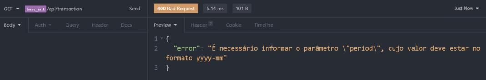<br>Requisição <strong>incorreta</strong>, pois não foi informado o parâmetro <strong>period</strong>.</p><br>

<p align="center">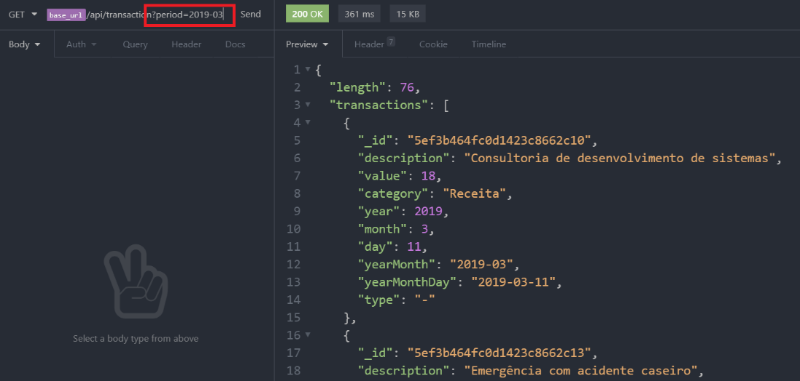<br>Requisição <strong>correta</strong>, pois foi informado o parâmetro <strong>period</strong>.</p><br>

### 📌 Fazer as implementações pendentes em `routes.js` e `transactionService.js` 
- Testar as rotas com o *Insomnia* e verificar se todo o
**CRUD** está sendo de fato refletido no *MongoDB*. 
- A implementação do código é livre.
- Considerar que todos os campos de `transaction` são obrigatórios!

<br>

## 📂 Etapa 3 – Implementação do Front End com React:
<br>

##### 📌 O Front End deve ser implementado a partir da pasta "client". 
<br>

##### 📌 Telas de definição livre. As telas a seguir são somente uma sugestão de interface.
<br>

##### 📌 Acessar a pasta `client` e digite `yarn` para instalar as dependências do projeto que são, além dos pacotes relacionados ao `create-react-app`:

- Pacote materialize-css.<br>
- Pacote axios.<br>
- Pacote react-modal.<br>

#### 📌 O arquivo `package.json` também foi modificado, conforme imagem abaixo. 
- Isso é importante para os casos onde tanto o Back End quanto o Front End estão hospedados no mesmo servidor, que é o caso deste projeto. 
- Mais informações podem ser encontradas [aqui](https://create-react-app.dev/docs/proxying-api-requests-in-development/).

<p align="center"></p><br>

### 📌 A implementação é obrigatória para as seguintes funcionalidades no Front End:

- Navegação de transações agrupadas por mês/ano (semelhante às rotas do Back End).
- Filtro simples a partir da descrição da transação. 
- Acentos e caracteres especiais devem ser considerados no filtro.
- Resumo com a quantidade de lançamentos, somatório de valores de receita, despesa e saldo agrupados por mês/ano.

<br>

### 📌 Algumas telas sugeridas para a aplicação Front End:

<br>

<p align="center">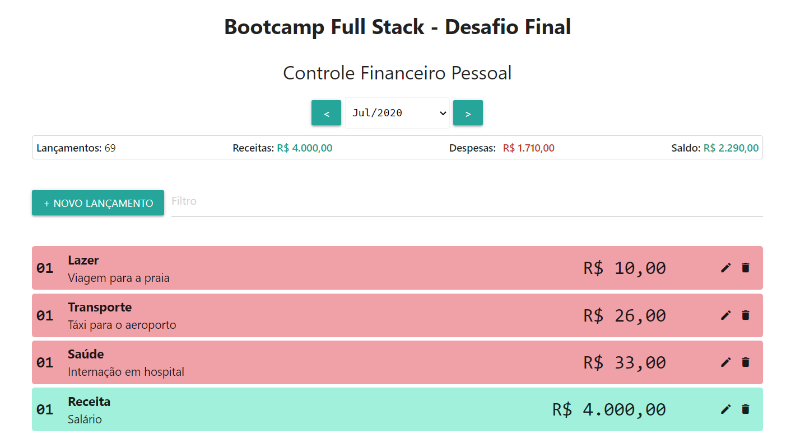<br>Estado inicial da tela (mês corrente).</p><br>

<p align="center">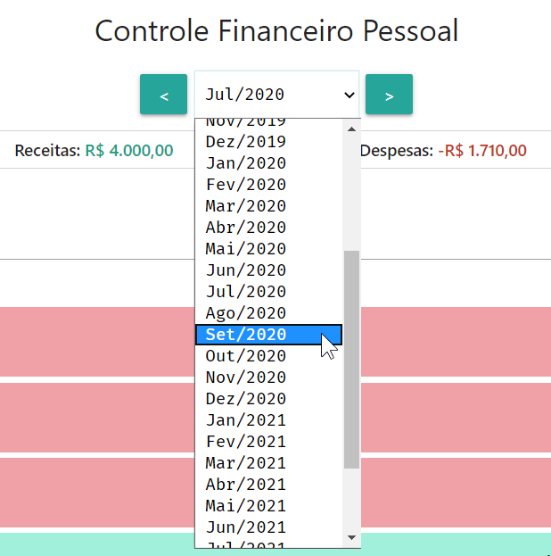<br>Seleção de períodos através de <strong>select</strong>.</p><br>

<p align="center">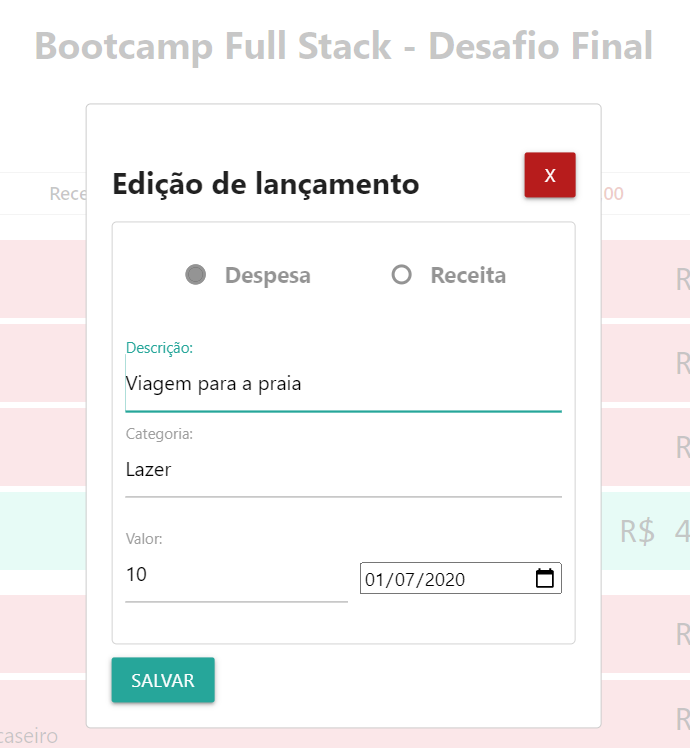<br>Edição de lançamentos, que não permite a troca do tipo (receita/despesa).</p><br>

<p align="center">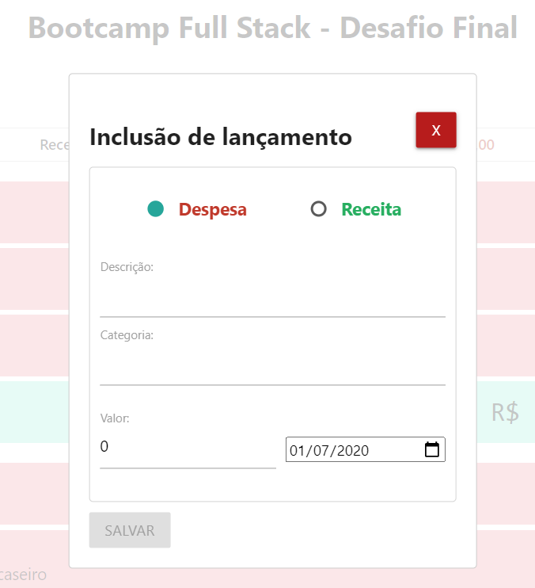<br>Inclusão de lançamentos.</p><br>

<p align="center">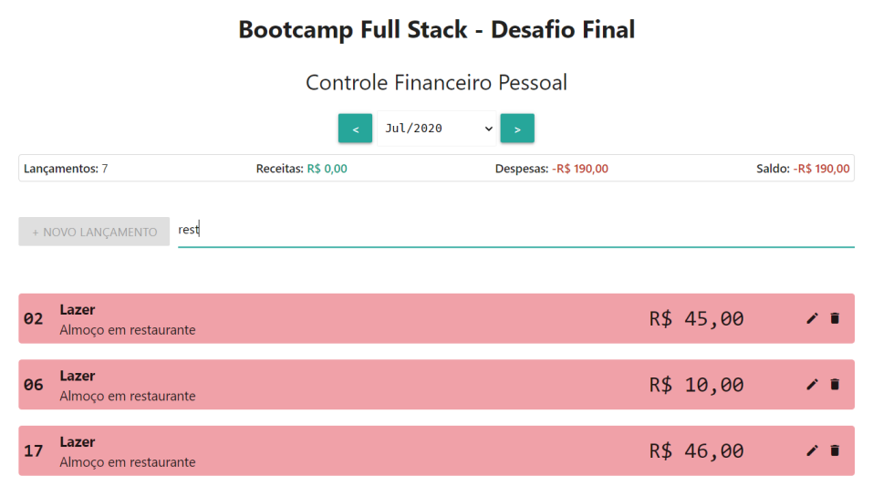<br>Filtro de lançamentos a partir da descrição.</p><br>

<br>

#### 📌 A exclusão de lançamentos pode ser implementada através do simples clique no ícone que representa a "Lixeira", conforme imagem acima.

<br>

#### 📌 Utilizar a tag `<select>` nos períodos, que no React tem o funcionamento um pouco diferente do HTML padrão. 

- Mais detalhes podem ser vistos [aqui](https://reactjs.org/docs/forms.html#the-select-tag). 

<br>

## 📂 Etapa 4 – Inclusão do código-fonte no GitHub e implantação no Heroku:
<br>

### 📌 Criar um repositório no GitHub e hospedar o `app` por lá. 
<br>

### 📌 Quanto à implantação, certificar que você já possui uma conta no Heroku e que a ferramenta Heroku CLI esteja devidamente instalada em seu computador.
- Testar com o seguinte comando: `heroku -v`

<p align="center">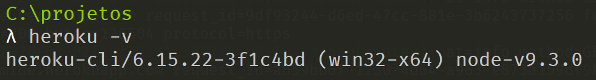</p><br>

### 📌 Acessar a pasta `app` e fazer o login no *Heroku* com o comando `heroku login`.

<p align="center">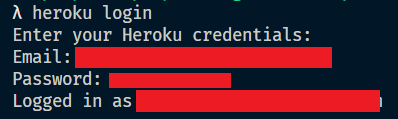</p><br>

### 📌 Criar um projeto no *Heroku* com o comando `heroku create nome_do_projeto`.
- Sugestão: `identificador-pessoal-desafio-final`. 
- O nome do projeto deve ser único e possuir, no máximo, 30 caracteres. 
- Caso não se importe com o nome, digite apenas `heroku create` que o próprio *Heroku* define um nome único para você.

<p align="center">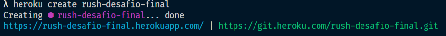</p><br>

### 📌 Acessar o site do *Heroku* e incluir a variável de ambiente `DB_CONNECTION`, que foi definida no arquivo `.env`, seguindo as imagens abaixo em sequência:

<p align="center">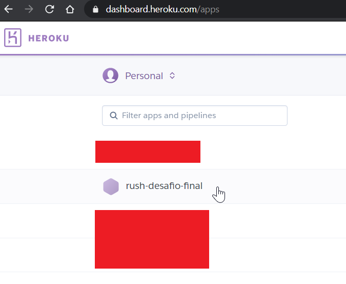<br>Acesse o seu projeto recém-criado.</p><br>

<p align="center">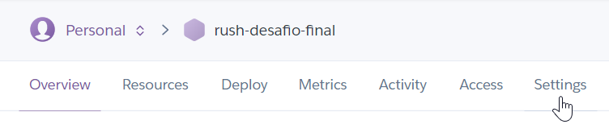<br>Acesse "Settings".</p><br>

<p align="center">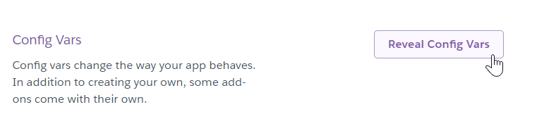<br>Acesse "Reveal Config Vars".</p><br>

<p align="center">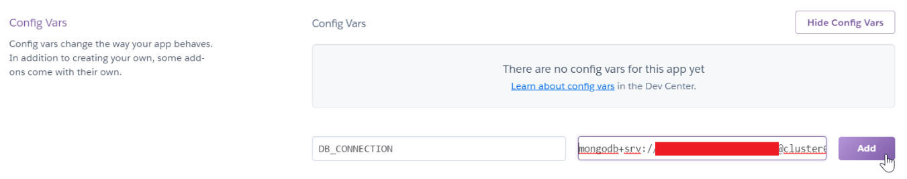<br>Preencha DB_CONNECTION e a String de conexão (sem aspas duplas) e clique em "Add".</p><br>

### 📌 Voltar ao terminal e digitar os seguintes comandos, conforme a ordem abaixo.

- Verifique a imagem abaixo com a saída de cada comando (alguns deles estão resumidos). 
- Esses comandos se referem à implantação no *Heroku*, que pode ser feita via *git*.
```bash
git init

heroku git:remote -a "nome-do-seu-projeto"

git add .

git commit -m "heroku"

git push heroku master
``` 
<p align="center">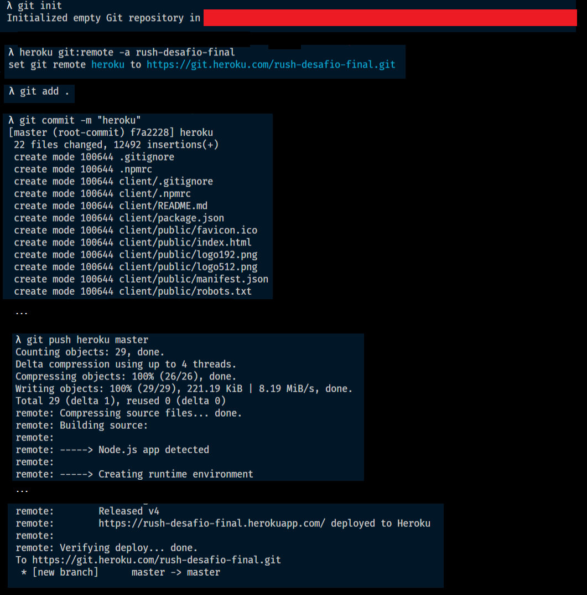</p><br>

### 📌 Se tudo deu certo, o `app` estará disponível conforme imagem abaixo.

<p align="center">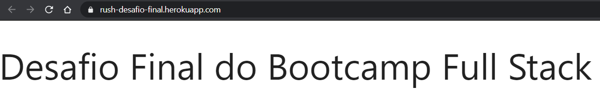<br>Neste exemplo, o app ainda está "vazio".</p><br>

A API pode ser acesada em: `http://nome-do-projeto.herokuapp.com/api/.`

<br>

##### 📌 Caso ocorra algum erro, verifique os passos anteriores. Caso persista o erro, volte ao terminal e digite `heroku logs --tail`. 
<br>

##### 📌 Caso efetuem alguma modificação no código-fonte, façam tanto o `push` no Github quanto o `push` no *Heroku*. Para o `push` no *Heroku* digite, após o commit, `git push heroku master`.
<br>

## Licença 

Esse projeto está sob a licença MIT. Veja o arquivo [LICENSE](../LICENSE) para mais detalhes.
