<h2 align="center">Desafio Final Bootcamp</h2>

  

  
  
  

___

<h3 align="center">
  <a href="#information_source-objetivos">Objetivos</a>&nbsp;|&nbsp;
  <a href="#book-enunciado">Enunciado</a>&nbsp;|&nbsp;
  <a href="#book-atividades">Atividades</a>&nbsp;|&nbsp;
  <a href="#licença">Licença</a>
</h3>

___

 

# ℹ️ Objetivos

Exercitar os seguintes conceitos trabalhados nos Módulos 01 a 04: 
✔️ Implementação de algoritmos com JavaScript. 
✔️ Criação de APIs com Node.js e Express. 
✔️ Criação de componentes com React com Class Components e/ou Functional Components. 
✔️ Persistência de dados com MongoDB e Mongoose. 
✔️ Implantação de aplicações web com Heroku. 

 

# 📚 Enunciado

Criar uma aplicação web para *Controle Financeiro Pessoal* com [MongoDB](https://www.mongodb.com) + [Node.js](https://nodejs.org) + [React](https://pt-br.reactjs.org) e implantação no [Heroku](https://www.heroku.com).

 

# 📚 Atividades

 

## 📂 Etapa 1 – Criação de Database e Collection no MongoDB e importação dos dados originais:

 

### 📌 Pré-requisitos:
- *Node.js* (recomenda-se a versão 12.9.1 ou superior);
- *Yarn* (recomenda-se a versão 1.22.4 ou superior, desde que se mantenha a versão 1.x) em seu computador. 
- Possuir uma conta devidamente criada no serviço *MongoDB Atlas* e já ter criado o seu *Cluster* gratuito. 
- Para não ter problemas com conexões, configurar o *cluster* para aceitar conexões de 0.0.0.0. Isso pode ser feito através da tela "Network Access".

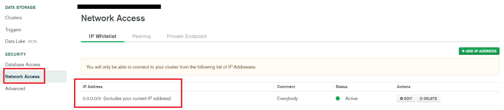
 

### 📌 Acessar o *Cluster* já criado no *MongoDB Atlas*. Em seguida, acessar a tela de *Collections* e criar um novo *Database*, conforme imagem abaixo. 

    **Database Name** – *DesafioFinalBootcampFullStack* 
    **Collection Name** – *transactions*

 

### 📌 Certificar que tanto o *Database* quanto a *Collection* foram devidamente criados.

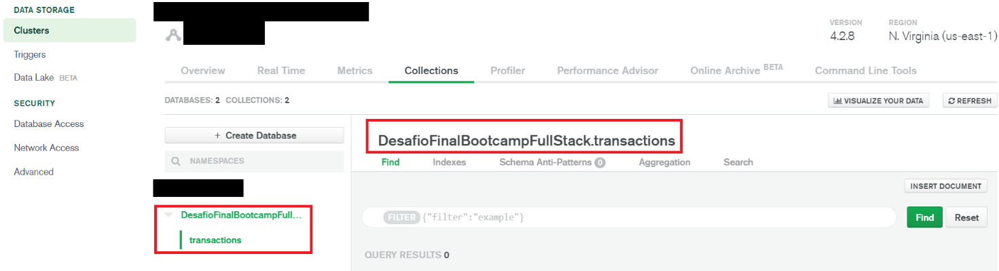
 

### 📌 Acessar a aplicação *Node.js* fornecida `(projeto "mongodb-import")` e executar o comando `yarn` para instalar todas as dependências já definidas em `package.json`. 
- Criar o arquivo `.env` na raiz do projeto e preencher `DB_CONNECTION` com os dados pertinentes ao seu Banco de Dados. 
- As dicas de como preencher o arquivo `.env` estão no arquivo `.env.example`. Há um comentário iniciado por # na linha 1 com um exemplo de preenchimento e um template para ser copiado/colado no arquivo `.env`.

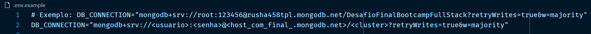
 

### 📌 Acessar a pasta do projeto `mongodb-import` no terminal de comandos e executar o seguinte comando: `yarn db`. A seguinte saída aparecerá no terminal e os dados originais do projeto serão copiados para o seu Banco de Dados.

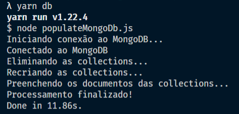
 

### 📌 Confirmar se os dados apareceram na conta no MongoDB Atlas. Recarregar a tela se necessário.

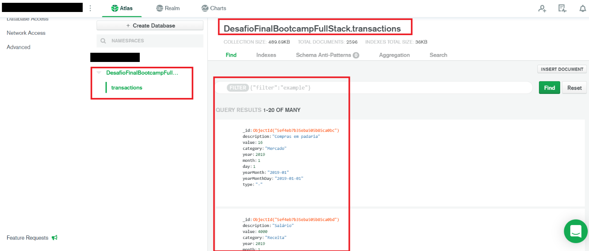
 

### 📌 Os registros importados foram gerados aleatoriamente através de combinações de descrições, categorias e valores. 
- Ficou definido o período como: todos os meses do ano anterior, ano atual e ano posterior, totalizando ao todo 36 períodos (atualmente: de jan/2019 até dez/2021, inclusive). 
- O código-fonte deste script será disponibilizado.
 

### 📌 Observação importante: 
- Na geração do arquivo original, houve uma pequena falha
e alguns registros com a descrição “Receita xyz...” foram criados como despesa.
- Considerar que as receitas são os registros com type `=== '+'` e as despesas são os registros com o type `=== '-'`. Desconsiderem a descrição. 
 

## 📂 Etapa 2 – Implementação do Back End:

 

### 📌 Utilizar como base o projeto app-vazio, que será disponibilizado. 
 

### 📌 Acessar a pasta app-vazio após a extração em alguma pasta ne renomear para app.
 

### 📌 Acessar a pasta app através de um terminal de comandos e digite o comando `yarn` para instalar as dependências.
 

### 📌 Verificar, estudar e entender as pastas e arquivos já contidos neste projeto:

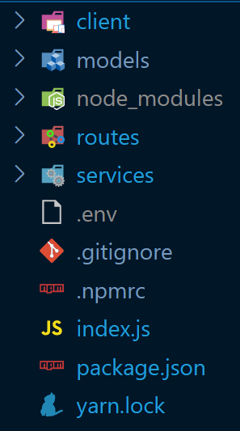
 

✔️ `Pasta client`: contém o projeto *React* (Front End).  
✔️ `Pasta models`: contém o arquivo `TransactionModel.js`, referente ao *Schema Mongoose* para a *Collection transaction*. Este arquivo já foi implementado entretanto, nada impede a modificação e adaptação. 
✔️ `Pasta routes`: contém o arquivo `routes.js` e deve conter as rotas, que deverão ser implementadas.  
✔️ `Pasta services`: contém o arquivo `transactionService.js` e deve conter a persistência de dados com o *MongoDB*, a ser também implementado.  
✔️ `Arquivo .env`: deverá ser criado e conter a String de conexão ao *MongoDB* `DB_CONNECTION`, assim como foi feito na etapa anterior. 
✔️ `Arquivo .npmrc`: contém uma configuração do NPM que faz com que as dependências sejam instaladas em sua versão exata (*save-exact*). Isso garante, em regra, mais estabilidade de apps em produção. 
✔️ `Arquivo index.js`: é onde tudo começa. Já há uma implementação de configurações do express e da conexão com o *MongoDB*. Basta garantir que a String `DB_CONNECTION` esteja devidamente preenchida no arquivo `.env`.

 

### 📌 Verificar, estudar e entender mais alguns detalhes importantes sobre o arquivo `index.js`:

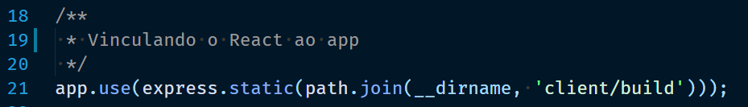
 

Este trecho de código faz com que o express hospede o React de produção (após o build).

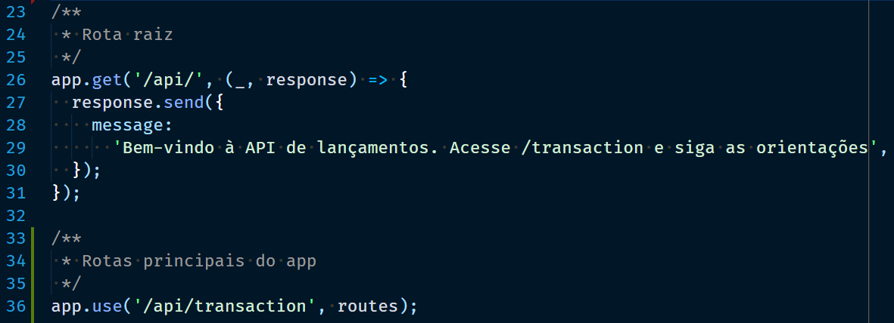
 

Este trecho de código faz com que a API principal do Back End (transaction) fique hospedada em `http://"meu_site_no_heroku".herokuapp.com/api/transaction`

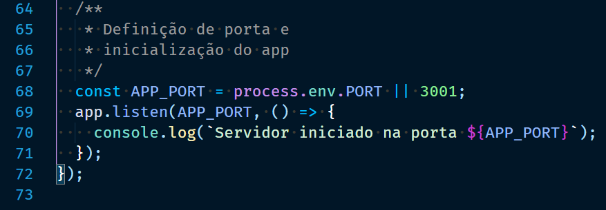
 

Neste trecho de código perceba que foi priorizado o valor de `process.env.PORT` para ser utilizado como porta do servidor de Back End. Isso será utilizado pelo Heroku
em produção. Em desenvolvimento, será adotada a porta `3001`, pois não há a variável `PORT` no arquivo `.env` local.

 

### 📌 Verificar, estudar e entender alguns detalhes importantes sobre o arquivo `package.json`:

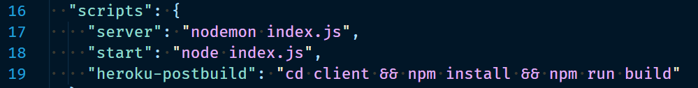
 

Para executar o servidor local, digite `yarn server`, que irá utilizar o *Nodemon* para tal. 
O script `heroku-postbuild` será utilizado pelo *Heroku CLI* para realizar o build da aplicação *React*. 

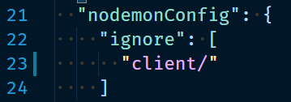
 

Configuração importante do *Nodemon* para que ele não "escute" a pasta do *React*, pois ela já tem um servidor próprio de desenvolvimento. Sem isso, qualquer alteração no
projeto *React* acarreta no reinício do servidor de Back End durante o desenvolvimento, o que não é desejável.

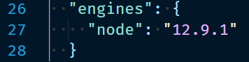
 

Configuração importante do Heroku para que ele utilize a mesma versão do *Node.js* de desenvolvimento em produção. Se a sua versão do *Node.js* for diferente de 12.9.1, faça a devida alteração nesse objeto de `package.json` e informe a versão que você está utilizando. Recomenda-se, entretanto, utilizar a versão 12.9.1.

 

## Licença 

Esse projeto está sob a licença MIT. Veja o arquivo [LICENSE](../LICENSE) para mais detalhes.
